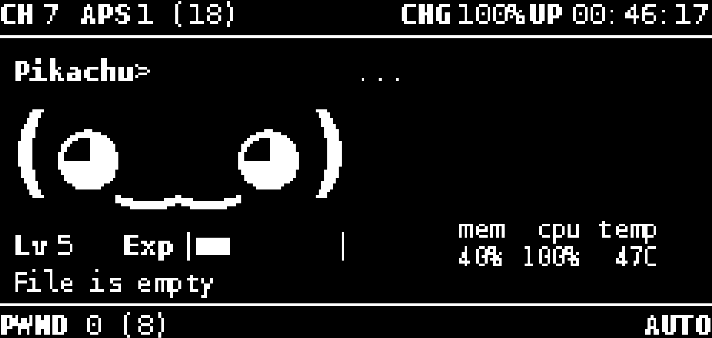

For a beginner-friendly step-by-step Web SSH setup guide, see `WEBSSH_SETUP.md`.

Copy expv3.py to /usr/local/share/pwnagotchi/custom-plugins/

Add the following to your /etc/pwngtochi/config.toml

[main.plugins.expv3]
enabled = true
lvl_x_coord = 5
lvl_y_coord = 81
exp_x_coord = 43
exp_y_coord = 81
bar_symbols_count = 10

Web SSH from Pwnagotchi Web UI

Copy webssh.py to /usr/local/share/pwnagotchi/custom-plugins/

Add the following to your /etc/pwnagotchi/config.toml

[main.plugins.webssh]
enabled = true
ttyd_url = "http://127.0.0.1:7681"
title = "Web SSH"

Note: localhost values are auto-mapped to your device host in the web page.
You can also set ttyd_url directly to your device IP, for example:
ttyd_url = "http://192.168.137.83:7681"

Open this page from your browser:
http://YOUR_PWNAGOTCHI_IP:8080/plugins/webssh/

Install and run ttyd on your Pwnagotchi (bookworm/debian):
sudo apt update
sudo apt install -y ttyd

Create /etc/systemd/system/ttyd.service with:

[Unit]
Description=ttyd web terminal
After=network.target

[Service]
Type=simple
ExecStart=/usr/bin/ttyd -p 7681 -c pi:changeme /bin/bash
Restart=always
User=root

[Install]
WantedBy=multi-user.target

Then enable it:
sudo systemctl daemon-reload
sudo systemctl enable --now ttyd

Important: change pi:changeme to a strong password.
